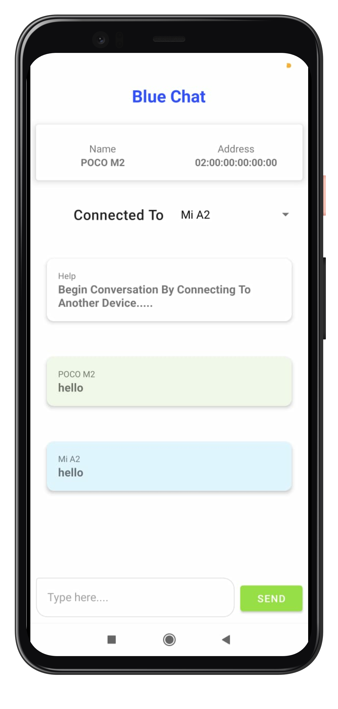

# Android Kotlin Bluetooth Chat App

[](https://kotlinlang.org/)
[](https://developer.android.com/)
[](https://github.com/AlakhiarovSalekh/Android-Kotlin-Bluetooth-Chat-App/stargazers)

An Android Bluetooth chat application written in Kotlin. The project demonstrates device-to-device communication in a native Android app.

<p align="center">
  
</p>

## Project Focus

- Native Android development with Kotlin
- Bluetooth-based device communication
- Chat-oriented mobile UI
- Gradle-based Android project structure

## Tech Stack

- Kotlin
- Android SDK
- Gradle
- Bluetooth APIs

## Getting Started

Clone the repository:

```bash
git clone https://github.com/AlakhiarovSalekh/Android-Kotlin-Bluetooth-Chat-App.git
```

Open the project in Android Studio, allow Gradle to synchronize, then run it on compatible Android devices. Bluetooth functionality requires devices with Bluetooth support and the permissions expected by the Android version being used.

## Repository Structure

```text
app/          Android application module
images/       README/media assets
build.gradle  Project build configuration
gradle/       Gradle wrapper files
```

## Contributing

Bug fixes, Android compatibility improvements, documentation updates, and UX improvements are welcome.

## Author

**Salekh Alakhiarov** · [GitHub](https://github.com/AlakhiarovSalekh)
